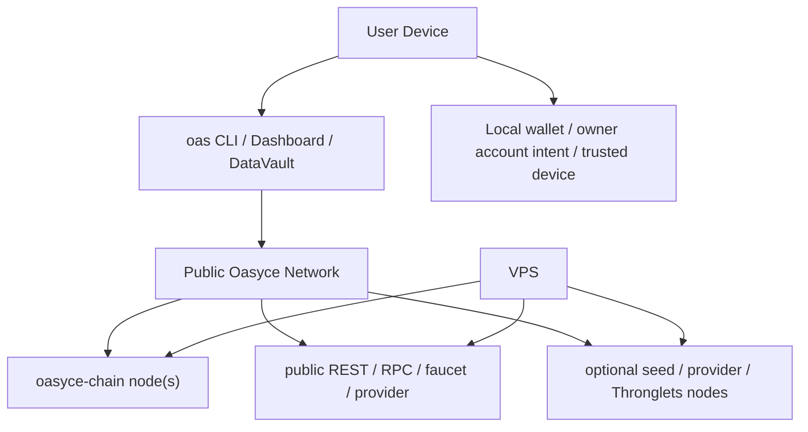

# Oasyce 部署边界

> 一句话：**`oasyce-chain` 和网络基础设施可以部署在 VPS；`oasyce-net` 默认是用户侧客户端 / agent runtime，不是中心化后台。**

## 为什么要有这份文档

很多团队天然会把 `oasyce-net` 想成一套要长期托管在服务器上的 Web App。

这在 Oasyce 里不准确。

Oasyce 更接近：

- `oasyce-chain`：链和公共基础设施
- `oasyce-net`：用户设备上的协议客户端、Dashboard、CLI、AI runtime

所以发布一个新版本时，通常是：

1. 更新链侧或公共基础设施
2. 发布新的 `oasyce` 包
3. 用户或 agent 自己升级本地客户端

而不是：

1. 把所有用户都切到一个中心化 `oasyce-net` 后台

## 部署边界图



## 什么应该部署在 VPS

这些是**网络基础设施**，适合放在 VPS：

- `oasyced` 链节点
- public REST / RPC
- faucet
- provider agent
- seed / relay / Thronglets 等网络节点
- `nginx` 和官网静态站

这些东西的共同点是：

- 面向整个网络
- 提供公共能力
- 不代表某一个终端用户的本地身份和会话

## 什么默认不需要部署在 VPS

这些默认是**用户侧**能力，不应该先假设跑在 VPS：

- `oas` CLI
- Dashboard
- DataVault 扫描和注册工作流
- 用户本地的 trusted-device 状态
- 本地 wallet / signer 选择
- `Codex` / `Claude Code` / 其他 agent 的本地运行时

这些东西的共同点是：

- 属于某个具体用户或某台设备
- 直接接触本地文件、AI 运行环境、trusted-device 授权
- 更像客户端，而不是公共后端

## 公测发布到底在发布什么

当前这套 Web3 网络的正常发布路径是：

1. 链和公共基础设施保持在线
2. 文档更新
3. `oasyce` PyPI 包更新
4. 用户设备执行：

```bash
python3 -m pip install --upgrade --upgrade-strategy eager oasyce odv
oas bootstrap
```

也就是说，**你们发布的主要是协议客户端，而不是中心化 SaaS 后台。**

## 那 Dashboard 是什么

Dashboard 是 `oasyce-net` 里的一个**本地操作面**：

- 用户自己电脑运行 `oas start`
- 浏览器打开本地 `localhost:8420`
- 它遵循同一个 `owner account + trusted device` 模型

它不是必须先被托管到 VPS 上，用户才能使用。

## 什么时候才需要把 `oasyce-net` 部署到 VPS

只有在这些场景下，才需要新增一条中心化或半托管部署链路：

- 你要提供一个**共享托管版 Dashboard**
- 你要提供一个**统一 API gateway**
- 你要跑一个**官方演示节点 / operator console**
- 你要做**托管 agent**，而不是本地 agent

这时部署的不是“协议必须项”，而是“产品附加项”。

## 当前推荐边界

### VPS

- 跑链
- 跑公共 REST / RPC
- 跑 faucet
- 跑 provider / seed / Thronglets 等网络服务
- 跑官网和静态站

### 用户设备

- 安装 `oasyce`
- 运行 `oas bootstrap`
- 运行 `oas start`
- 运行本地 AI / DataVault / trusted-device workflow

## 最终判断

如果你问：

**“这次版本更新后，要不要把 `oasyce-net` 也部署到 VPS？”**

默认答案是：

**不要。**

因为在 Oasyce 当前架构里，`oasyce-net` 本来就主要是用户侧客户端。

只有当你们明确要做托管产品面时，才需要额外部署一套 VPS 上的 `oasyce-net` 服务。
